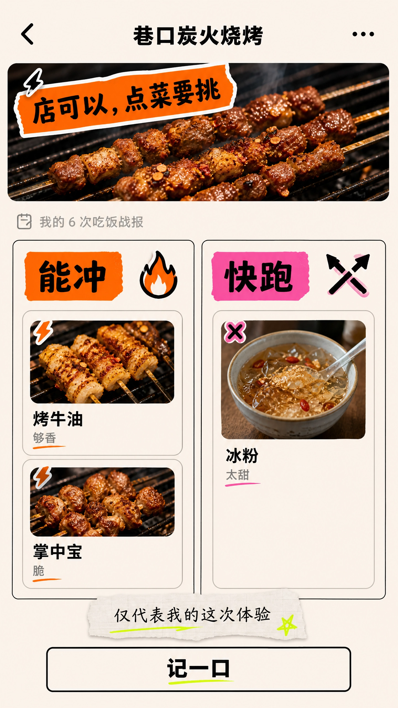
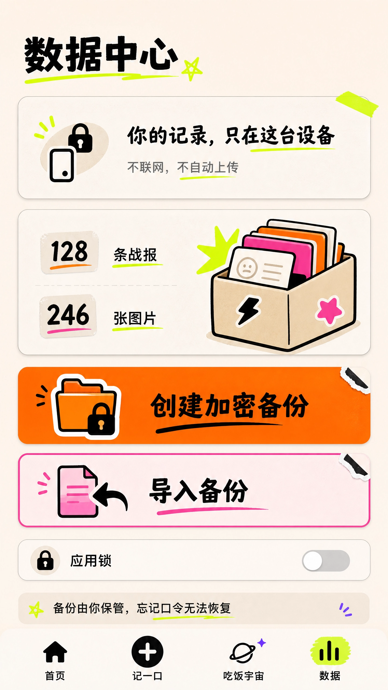

# 好吃不 Chewsy

<p align="center">
  
</p>

<p align="center">
  <strong>记住每一次吃过的店，下次少踩一次雷。</strong><br>
  不是大众评分，也不是美食推荐，只记录你自己的真实体验。
</p>

<p align="center">
  <a href="https://github.com/ljchengx/Chewsy">GitHub 仓库</a>
  · Flutter
  · Android 优先
  · 离线优先
</p>

## 为什么做它

你可能记得自己去过一家店，却记不清当时为什么说“还行”，也记不清是哪道菜让你决定“下次别来了”。等下一次又站在店门口，只能重新赌一次。

好吃不把每顿饭变成复杂的评分表。你只需要先给这次体验一个判断，再留下几句真正有用的理由。下次想吃什么、要不要再去，直接搜自己的记录就够了。

> 你不需要别人告诉你这家店好不好，你需要记得上次的自己为什么这样判断。

## 一次记录，解决下一次选择

<p align="center">
  
  
  
</p>

1. **先选判词**：种草、观望、踩雷，先把当下感受留下来。
2. **记一次到店**：店名必填，菜名可以写多道，也可以只记录整家店的体验。
3. **补一句理由**：从预设理由开始，也可以写下只有你自己懂的细节。
4. **下次先搜店**：按店名或菜名搜索，结果按店铺聚合，直接回看完整历史。
5. **发现记错就改**：编辑原记录或永久删除，不让错误信息一直影响下一次决定。

## 它记录的不是“标准答案”

好吃不刻意保持克制：

- 不做公开评分榜，不拿别人的口味替代你的判断。
- 不自动给店铺贴上“推荐”或“避雷”结论，只展示你的真实经历。
- 不要求每次都拍照、写长评或填满表单，店名和一次判断就能完成记录。
- 不依赖地图、定位、在线搜索或云端账号，吃饭时也能随手记下。

## 当前功能

- 以店铺为核心的一顿饭记录，一条记录支持多道菜。
- “种草 / 观望 / 踩雷”三种统一判词，以及预设和自定义理由。
- 草稿自动保存，杀掉应用后仍可继续未完成的记录。
- Android 相机和相册入口，图片保存在应用私有目录并按哈希去重。
- 首页直接搜索店名、菜名、短评和理由，搜索结果按店铺聚合。
- 店铺历史按时间倒序展示每次到店的菜品、理由、短评和图片。
- 已发布记录支持编辑和永久删除，修改保留原记录身份。
- 吃饭宇宙支持历史浏览、判词筛选、本月筛选和种草记录盲抽。
- 数据中心、备份和导入入口已保留，暂不作为当前产品主线。

## 界面一览

### 首页：先回忆，再决定

首页把最近吃过的记录和快速判词放在一起。想起一家店时，可以从这里直接开始搜索。

<p align="center">
  
  
</p>

### 记一口：先判词，再写理由

记录流程从最重要的判断开始，不要求你在饭桌上完成一份长问卷。店名、菜名、照片和理由都可以按当下记忆逐步补齐。

<p align="center">
  
  
</p>

### 店铺历史：只看发生过什么

同一家店的每次到店记录集中在一起。你可以看到当时吃了什么、为什么种草或踩雷，而不是一个脱离上下文的系统结论。

<p align="center">
  
</p>

### 数据中心：你的吃饭档案

数据中心用于回看自己的记录规模和数据管理。备份、导入等能力会继续完善，但不抢占“记录和避坑”这条主线。

<p align="center">
  
</p>

<details>
<summary>查看完整设计图</summary>

<p align="center">
  
  
  
  
  
  
  
  
  
  
  
</p>

</details>

## 产品模型

好吃不把一顿饭看成一道孤立的菜，而是看成一次到店经历：

```text
一家店
└── 多次到店记录
    ├── 本次整体判词
    ├── 本次吃过的多道菜
    ├── 预设理由和自定义理由
    ├── 短评、图片和用餐时间
    └── 可修改、可删除的真实历史
```

店名是进入历史的入口，菜名是帮助未来回忆的线索，判词和理由才是下次决定是否再去的依据。

## 技术实现

- Flutter / Dart
- Drift + SQLite：离线持久化记录、店铺、菜品、理由、草稿和图片元数据
- Riverpod：运行时依赖和页面状态
- `image_picker`：Android 相机和相册
- `path_provider`：应用私有文件目录
- `archive`：本地备份归档

应用默认把数据保存在设备本地，不接入地图、定位、云同步、统计 SDK 或在线搜索。

## 本地运行

```bash
flutter pub get
flutter run
```

常用验证命令：

```bash
flutter analyze
flutter test
flutter build apk --debug
```

Debug 构建首次启动会注入示例记录，Release 构建首次启动为空。

## 项目结构

```text
lib/
├── app/                    # 启动和运行时依赖
├── data/database/          # Drift 数据库和表
├── data/repositories/      # 记录和数据访问
├── domain/                 # 领域模型
├── features/               # 记录、宇宙、数据中心页面
└── services/               # 媒体和备份服务
```

## 本地文件目录

```text
Documents/haochibu/
├── media/original/
├── media/thumb/
├── generated/
└── tmp/
```

## 项目状态

这是一个仍在持续打磨中的个人离线 App。当前优先级只有一件事：让每一次真实的吃饭经历，在下一次选择之前真正帮上忙。
