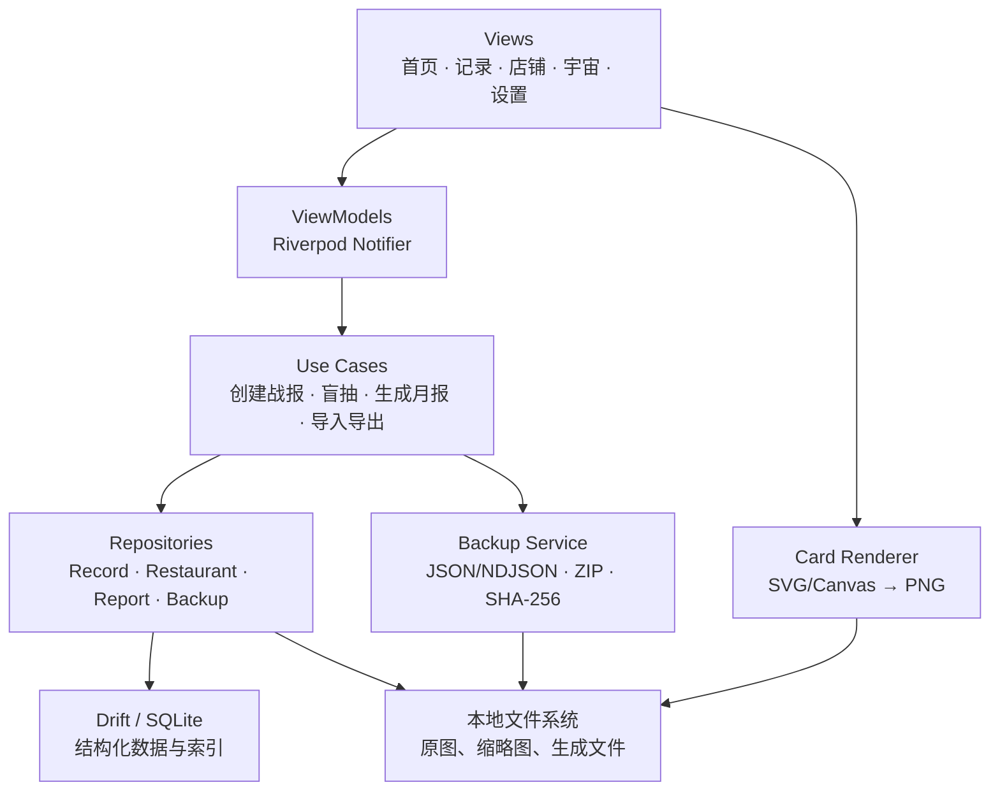
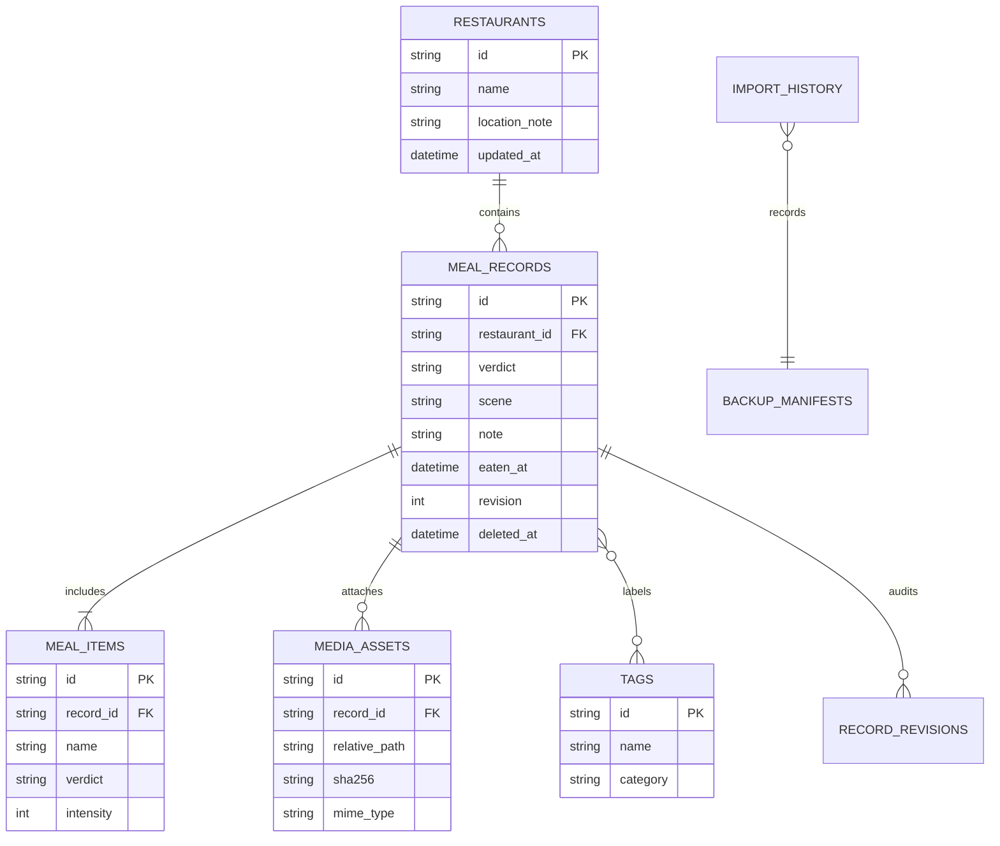

# 「好吃不」Flutter 纯离线版技术实施说明书

**版本：** V1.0（开发基线）  
**适用端：** iOS、Android；桌面端作为后续可选扩展  
**数据原则：** 应用不发起网络请求、不接入云服务，用户数据仅保存在设备本地；跨设备迁移仅由用户主动执行备份导入与导出。  
**依据：** 《「好吃不」年轻化设计更新方案》

> **产品定义。** 「好吃不」不是餐饮评分平台，而是用户自己的“吃饭态度库”。每一条数据是一次主观、带场景的“吃饭战报”；系统的职责是帮助用户快速记录、回看、筛选和迁移这些私有记录，而不是建立商户公域信息库。

---

## 1. 文档目标与范围

本文将设计稿中“判词卡、食物战报、能冲／快跑、我的吃饭宇宙、盲抽和月度回放”等体验，落到可实施的 Flutter 技术方案中。方案以 **iOS 与 Android 的纯本地单机应用** 为首发目标，不包含账号、登录、云同步、在线搜索、地图、远程语音转写、埋点、广告或推送。即使设备处于飞行模式，除用户主动将已生成文件交给其他应用外，核心功能也应完整可用。

Flutter 官方建议将 UI 与数据职责拆分为 View、ViewModel、Repository 和 Service；Repository 作为模型数据的唯一事实来源，向上提供领域模型。[1] 本项目据此采用“特性模块 + MVVM + Repository + 本地数据源”的结构，避免页面直接操作数据库或文件系统。对于需要较多查询和关联的数据，Flutter 官方也建议优先使用数据库而不是普通文件或键值存储。[2]

| 范围 | V1.0 交付 | 明确不做 | 说明 |
|---|---|---|---|
| 核心记录 | 判词、店铺、菜品、标签、短评、消费场景、日期、图片 | 公域店铺库、在线餐厅搜索 | 店铺和菜品均由用户本地创建、修改与合并 |
| 回看决策 | 时间线、店铺“能冲／快跑”、本地筛选、今晚吃啥盲抽 | 推荐算法服务、在线榜单 | 所有计算由设备端 SQL 与规则引擎完成 |
| 表达内容 | 食物战报 PNG、月度回放、口味人格卡 | 站内动态、好友关系链、评论区 | 图片在本地生成；外部分享由用户自行选择 |
| 数据迁移 | 全量备份、导入预检、合并、冲突处理、恢复演练 | 自动云备份、后台同步 | 使用普通 `.haochibu` 文件，由用户自行保存 |
| 隐私安全 | 无网络依赖、关闭系统云备份、可选应用锁、导出确认 | 分析 SDK、广告 SDK、远程崩溃收集 | 系统自动备份也应被禁止或排除 |

### 1.1 离线承诺的精确定义

“离线优先”不足以表达本项目要求。本项目采取更严格的 **“应用无网络数据通路”** 标准：发行包不声明 Android `INTERNET` 权限，不引入 HTTP 客户端、远程配置、统计分析、广告、地图或云端 SDK；iOS 端也不实现任何业务网络请求。用户可以选择把导出的备份文件保存到文件系统、隔空投送或交给第三方应用，但该动作必须由用户显式触发，离开本应用后的传输、云同步或保留规则由目标应用和用户设备设置决定。

Android 的 Auto Backup 默认可将内部文件、SQLite 数据库、SharedPreferences 与应用专属外部文件上传至用户 Google Drive。[6] 因此，仅仅“不写联网代码”还不够：本项目必须在 Android 关闭自动备份及设备迁移备份；iOS 则需在原生层对应用数据根目录设置 `isExcludedFromBackupKey`，该键用于让系统将资源排除在应用数据备份之外。[7]

---

## 2. 产品体验到功能模块的映射

首页的“今天这口，值不值？”、记录页的三张大判词卡和店铺页的双栏结论是首期识别度最高的体验。技术上不应为视觉概念建立孤立的数据模型，而应围绕一条“吃饭记录”建立稳定主数据，再由查询、聚合和本地渲染派生不同页面。

| 设计体验 | 用户动作 | 本地数据来源 | Flutter 实现重点 |
|---|---|---|---|
| 今日口味卡 | 打开应用、回看一条旧记录 | 最近记录或按日期稳定随机抽取的“收下”记录 | 本地日种子 + SQL 查询；不依赖在线推荐 |
| 三张判词卡 | 选“给我收下／就那样吧／立刻绕行” | `meal_records.verdict` | 拖拽或点击均可完成；三秒内先保存立场，再补字段 |
| 发布吃饭战报 | 添加店、菜、标签、短评、图片 | `meal_records`、`meal_items`、`media_assets` | 表单分步、自动草稿、退出不丢失 |
| 店铺“能冲／快跑” | 查看同店结论 | 同一 `restaurant_id` 下菜品记录聚合 | 按菜品与判词分栏，展示“店可以，点菜要挑” |
| 我的吃饭宇宙 | 按月回看与筛选 | 时间索引、标签、判词、场景 | 分页列表 + 本地索引；不做全量内存加载 |
| 美味盲抽 | 从想再吃中选今晚吃什么 | `verdict=keep`、`revisit_intent=true` | 过滤后使用本地安全随机数抽取 |
| 口味人格／月报 | 生成可分享战报 | 标签频次、判词占比、时间区间 | 固定规则字典 + 本地统计；不调用大模型 |
| 战报分享卡 | 生成图片，交给用户保存或分享 | 单条记录及关联图片 | `CustomPainter` 或 SVG 在本地合成，输出 PNG |

### 2.1 纯离线下的功能取舍

设计稿中的“搜索、定位、语音转文字、好友主题清单”在联网产品中常依赖外部服务。为守住数据边界，V1.0 将“搜索”限定为**个人数据库内的店名、菜名和标签搜索**；位置仅支持用户输入商圈、地标或简短地址，不调用地图、逆地理编码或商户接口。语音转文字不进入 V1.0，避免调用云端听写；如要保留表达入口，可在后续版本加入“仅保存在本机的语音备忘”，或在完成离线识别引擎评估后再启用。

“朋友来问”“口味接头暗号”也不做站内社交。V1.0 可将一份筛选后的本地记录生成图片或专用备份包，由用户使用设备已有能力转交；应用自身不保存联系人、关系链或任何外部身份信息。

---

## 3. 总体架构与工程结构

应用采用 **Feature-first + MVVM**。View 只处理布局、动效和交互事件；ViewModel 持有可观察 UI 状态并编排用例；Repository 负责领域模型、事务、去重与错误转换；Service 负责数据库、文件、归档、加密和本地生成。该边界使未来即使更换数据库实现或调整备份格式，也不会波及判词卡、店铺页等 UI。



Flutter 官方架构指南将 Repository 定义为数据模型的事实来源，并指出其应把原始数据转换为 ViewModel 可消费的领域模型。[1] 因而页面不可直接引用 Drift DAO、`File` 或压缩库；所有写入都通过用例或 Repository 进入，以保证草稿、媒体、数据库与导入事务的一致性。

| 层级 | 推荐组成 | 职责 | 禁止事项 |
|---|---|---|---|
| Presentation | Flutter、Material 3、自定义主题、Riverpod、路由 | 响应式界面、判词动效、无障碍、错误提示 | 直接执行 SQL、读写图片文件、拼接备份格式 |
| Application | Use Case、DTO、校验器、规则引擎 | 编排“保存记录”“抽一顿饭”“导入备份”等跨模块流程 | 依赖具体 Widget 或原始表行 |
| Domain | Entity、Value Object、Repository Interface | 描述 `MealRecord`、`Verdict`、`Restaurant` 等稳定业务概念 | 存放平台路径、插件调用或 UI 文案 |
| Data | Drift DAO、Repository Impl、迁移、Mapper | SQLite CRUD、索引、事务、软删除、查询聚合 | 输出未处理的数据库实体给 UI |
| Device | 文件、相机／相册、归档、保存／选择器、应用锁 | 与系统平台能力交互，全程本地执行 | 发起业务网络连接或收集设备标识 |

### 3.1 推荐目录

```text
lib/
  app/                         # 应用壳、主题、路由、启动检查
  core/                        # Result、错误类型、日期/UUID、常量、无网络守卫
  features/
    home/                      # 今日口味卡、双入口、盲抽
    record/                    # 判词、草稿、拍图、标签、编辑
    restaurant/                # 店铺结论、能冲/快跑
    universe/                  # 时间线、筛选、口味人格、月报
    report_card/               # 食物战报图生成与保存
    data_center/               # 导入、导出、容量、清理、隐私
  domain/
    entities/                  # 不依赖 Flutter/SQLite 的领域实体
    repositories/              # Repository 接口
    usecases/                  # 业务用例
  data/
    local_db/                  # Drift 表、DAO、迁移、查询
    repositories/              # Repository 实现和 Mapper
    services/                  # 文件、媒体、归档、导入导出
  platform/                    # Android/iOS 原生通道：禁备份、文件交接、相册
  l10n/                        # 文案；所有“判词”可配置且支持后续本地化
```

### 3.2 依赖策略

依赖只允许满足设备端能力，不得包含会自行联网、上报或加载远程资源的 SDK。版本号不在本文固定，以项目初始化当天的稳定版为准，并由 `pubspec.lock` 锁定；每次升级都需重新执行网络审计和导入导出回归测试。

| 能力 | 建议依赖或实现 | 选择理由 | 离线约束 |
|---|---|---|---|
| 状态管理 | `flutter_riverpod` | 以可测试的 Provider 管理页面状态和依赖 | 仅状态容器，不引入远程 Provider |
| 关系型存储 | `drift` + SQLite | 适合多表关联、全文/模糊搜索、聚合与受控迁移 | 数据库仅位于应用私有目录 |
| 文件目录 | `path_provider` + `dart:io` | 可定位应用 Documents 等本地路径并读写文件。[3] | 缓存目录不得作为唯一数据副本 |
| 导入选择 | `file_selector` | 使用系统原生文件选择界面选择备份包。[4] | 仅接受 `.haochibu` 类型，不上传文件 |
| 手机端导出交接 | 平台 Share Sheet 封装或成熟本地分享插件 | iOS/Android 由用户选择“文件”等目标应用 | 导出前二次确认；不自动分享 |
| 图片采集与压缩 | 相机／相册插件 + 本地压缩实现 | 记录支持拍图优先，压缩减少备份体积 | 禁用云端图片处理与远程字体 |
| 归档 | `archive` | 构建 ZIP 归档，容纳 JSON 与媒体文件。[5] | 归档只在临时目录生成并清理 |
| 备份完整性 | `crypto` | 提供 SHA-256，用于媒体和归档校验 | 只在本地计算，不上传、不落盘 |
| 可选应用锁 | 平台 Keychain/Keystore 封装、`local_auth` | 用生物识别或设备凭据锁住入口 | 不把密钥写入日志或偏好设置 |

---

## 4. 本地数据与媒体设计

### 4.1 存储分层

结构化业务数据进入 SQLite，照片及生成图片进入文件系统，数据库仅保存相对路径、媒体哈希和元信息。Flutter 官方说明应用 Documents 目录适合保存应用私有、仅在卸载时才会被清理的文件；临时缓存则可被系统随时清除。[3] 因而原图、缩略图和关键导出文件不可只放在缓存目录。

| 存储对象 | 位置 | 保存形式 | 生命周期 |
|---|---|---|---|
| 主数据库 | 应用私有数据库目录 | `haochibu.sqlite`、WAL、SHM | 随应用数据存在；用户清除数据或卸载时删除 |
| 原始/压缩图片 | `Documents/haochibu/media/original/` | 按内容哈希分层命名 | 随关联记录存在；清空回收站后可清理未引用媒体 |
| 缩略图 | `Documents/haochibu/media/thumb/` | JPEG/WebP，最长边固定 | 可由原图重建，允许容量清理 |
| 草稿与导入暂存 | 应用 Cache 或 `tmp/` | 未完成表单、备份 ZIP、暂存媒体 | 退出后可恢复草稿；导入结束立即清理工作区 |
| 战报图片 | `Documents/haochibu/generated/` | PNG | 用户保存前的临时产物；可按 7 天清理 |
| 备份成品 | 用户选定的位置或临时交接文件 | `.haochibu` | 默认不常驻应用目录，避免重复占用空间 |

建议使用**内容寻址**管理媒体。导入或保存一张图片时，在本地读取字节并计算 SHA-256；最终文件名采用 `sha256`，例如 `ab/cd/abcdef....jpg`。不同记录引用相同文件时只保存一份，既能减少备份体积，又能在导入时自然去重。显示顺序、裁剪与图片说明保存在 `media_assets` 表，不写入文件名。

### 4.2 核心数据模型

所有可迁移实体采用 UUID v4 作为跨设备稳定主键，并保存 UTC 时间、修订号、内容哈希和软删除时间。不要使用 SQLite 自增 ID 作为备份主键，否则两台离线设备分别新增数据后必然冲突。软删除记录须在导出包中保留，以便跨设备导入时能够传播“已删除”状态；用户在“回收站”彻底清除后，才可从后续备份中移除。



| 表 | 关键字段 | 核心约束与索引 | 用途 |
|---|---|---|---|
| `restaurants` | `id`、`name`、`alias`、`location_note`、`is_home_made` | `id` 主键；`normalized_name` 索引；名称不是全局唯一 | 仅保存用户输入的本地店铺／家庭自制来源 |
| `meal_records` | `id`、`restaurant_id`、`verdict`、`scene`、`note`、`eaten_at`、`created_at`、`updated_at`、`revision`、`deleted_at` | `eaten_at DESC`、`restaurant_id + deleted_at`、`verdict + eaten_at` 索引；判词为枚举 | 一次吃饭战报的主体，保留体验语境 |
| `meal_items` | `id`、`record_id`、`name`、`verdict`、`intensity`、`reason` | `record_id`、`normalized_name` 索引；级联逻辑删除 | 支撑一条记录多道菜，以及店铺页“能冲／快跑” |
| `tags` | `id`、`name`、`category`、`is_system` | 名称折叠后唯一；系统标签不可物理删除 | “锅气够、太甜、难等、价格飘”等本地标签 |
| `record_tags` | `record_id`、`tag_id` | 联合主键；两端均建立索引 | 记录与标签的多对多关系 |
| `media_assets` | `id`、`record_id`、`relative_path`、`sha256`、`mime_type`、`width`、`height`、`byte_size` | `sha256` 唯一索引；路径只能是相对路径 | 图片引用、去重、完整性校验与清理 |
| `record_revisions` | `id`、`record_id`、`revision`、`content_hash`、`changed_at` | `record_id + revision` 唯一 | 用于冲突判定和可控审计；只保存结构化差异，不复制大图 |
| `import_history` | `backup_id`、`imported_at`、`result_digest` | `backup_id` 唯一 | 防止同一备份反复导入；不保存备份口令 |
| `app_settings` | `key`、`value`、`updated_at` | 键唯一 | 主题、战报偏好、应用锁开关、容量策略 |

`verdict` 必须是固定领域枚举：`keep`（给我收下）、`neutral`（就那样吧）、`avoid`（立刻绕行）。界面文案、颜色、动效和自定义贴纸可变化，但数据库存储值不得随文案变化。菜品判词允许与整体判词不同，因而“店可以，点菜要挑”可以通过本地聚合得出，而不需要误导性的综合星级。

### 4.3 数据库迁移与写入原则

数据库版本通过 Drift migration 管理，每次发布若修改表结构，必须编写**前向迁移、升级测试和回滚/恢复说明**。备份包保存独立的逻辑数据格式，不直接复制 `.sqlite`、WAL 或 SHM 文件；这样能避免数据库引擎版本、页面大小和未提交日志影响跨版本恢复。

所有“保存战报”操作应使用单一事务提交：先校验文本、标签和关联项，再写入记录、菜品、标签关系与媒体元数据。媒体文件须先保存为临时文件、计算哈希、原子移动到最终目录，随后在事务中建立引用；若事务失败，后台清理孤儿临时文件。页面点击“返回”时不丢内容，应保存可恢复草稿，但草稿不参与月报、盲抽和导出，直到用户确认发布。

---

## 5. 导入导出设计

### 5.1 备份格式

V1.0 只提供**全量普通备份**，而不是“部分记录分享包”。全量格式更容易验证、恢复和演练；战报图片负责轻量表达，数据备份负责迁移。`.haochibu` 本身就是 ZIP 文件，把 JSON 数据与媒体文件封装在一起；Dart `archive` 支持 ZIP 等归档和压缩格式。[5] 不增加口令、加密封装或旧格式兼容层，校验和只负责发现文件损坏。

```text
haochibu-backup-20260820-104530.haochibu
├── manifest.json               # 导出 ID、格式版本、时间和数量
├── records.ndjson              # 一行一个记录，便于流式读写
├── restaurants.ndjson
├── tags.ndjson
├── media/index.ndjson          # 媒体元数据和相对路径
├── media/<sha256>              # 内容寻址媒体文件
└── checksums.sha256            # 逐文件完整性校验表
```

| 字段 | 规范 | 目的 |
|---|---|---|
| 文件扩展名 | `.haochibu` | 限定导入选择类型，避免用户误选任意压缩包 |
| `magic` | `manifest.json` 固定为 `HAOCHIBU_PAYLOAD` | 识别合法备份内容 |
| `schemaVersion` | `manifest.json` 中的逻辑数据版本号 | 校验当前备份结构 |
| `backupId` | UUID v4 | 标识一次导出，避免重复导入 |
| `checksum` | 归档内每个文件的 SHA-256 | 定位媒体损坏或漏包 |

备份不需要额外设置。文件完整性由 ZIP 路径校验、NDJSON 校验和媒体 SHA-256 共同保证。

### 5.2 导出流程

导出是用户主动的数据外带操作，应避免后台自动执行。手机端原生文件选择能力存在平台差异：`file_selector` 可在 Android/iOS 选择文件，但其“选择保存位置”能力并不覆盖这两个移动平台。[4] 因此移动端应先在应用临时目录生成备份，再调用系统 Share Sheet，让用户选择“存储到文件”、隔空投送或其他目标；桌面端可直接使用保存位置对话框。

| 步骤 | 系统动作 | 用户可见反馈 | 失败处理 |
|---|---|---|---|
| 1. 发起 | 用户在“数据中心”点击“导出备份” | 展示数据量和预计空间 | 可取消，不生成任何文件 |
| 2. 一致性快照 | 以数据库只读事务流式读取逻辑数据 | 进度显示“整理记录” | 保留原始数据，不修改数据库 |
| 3. 打包校验 | 创建 NDJSON、复制媒体、生成 SHA-256、ZIP | 进度显示“打包图片” | 删除临时工作目录 |
| 4. 用户保存 | 打开系统交接界面 | 明示第三方目标可能自行同步 | 用户取消即删除交接临时文件 |
| 5. 收尾 | 清理临时文件 | 显示导出完成时间、文件大小 | 不保留临时备份 |

导出前需要检查设备可用空间至少覆盖“估算数据 + ZIP 临时文件 + 备份成品”的峰值；经验上按待导出媒体体积的 2.2 倍预留。超过容量时应给出“先清理缩略图／生成文件”“仅保留原图”“取消”三种本地处理选择，而不是尝试上传云端。

### 5.3 导入流程与事务边界

导入默认采用**合并并去重**，不得一打开文件就覆盖现有数据。用户先通过原生选文件器选择 `.haochibu`，系统仅在隔离暂存目录中完成文件校验、解压和预检。预检通过后才允许点击“确认导入”。

| 阶段 | 必做校验 | 结果 |
|---|---|---|
| 归档验证 | 文件大小、ZIP 结构、版本和备份 ID | 结构异常或被篡改文件立即终止，不写库 |
| 安全解压 | 条目数、单文件大小、压缩比、相对路径、禁止 `..` 与绝对路径 | 防止 Zip Slip 和压缩炸弹 |
| 内容校验 | `manifest`、NDJSON schema、UUID 格式、媒体索引、SHA-256 | 给出可理解的“备份损坏位置”提示 |
| 容量校验 | 暂存空间、最终媒体空间、数据库增长预估 | 空间不足时不开始写入 |
| 变更预览 | 新增、更新、跳过、冲突、删除墓碑数量 | 用户确认自己将改变什么 |
| 合并提交 | 数据库事务、媒体暂存、原子移动、导入历史 | 完成后生成本地导入报告 |

为抵抗恶意或意外损坏包，V1.0 默认限制应写入配置：容器最大 1 GiB、解压后最大 4 GiB、单媒体最大 30 MiB、条目最多 60,000 个、解压压缩比最高 20:1。实现必须以流方式处理 NDJSON、哈希和媒体文件，禁止将整个备份或整张原图一次性读入内存。

文件系统和数据库不能天然组成一个跨资源的原子事务，因此采用“**暂存—数据库标记—原子移动—完成标记—启动恢复**”流程：先把经过校验的媒体放入 `import_staging/<importId>/`；在 SQLite 事务中写入或更新记录，并把新媒体标为 `pending`；提交后把同一分区内文件原子移动至内容寻址最终目录；最后一笔事务将媒体改为 `ready`。应用启动时扫描 `pending`：若最终文件存在且哈希正确，则补写 `ready`；若不存在，回滚该次未完成的导入写入。这样即使导入中断、断电或被系统杀死，也不会留下“记录指向不存在图片”的静默损坏。

### 5.4 去重与冲突规则

| 情形 | 自动策略 | 用户操作 |
|---|---|---|
| 本机不存在该 UUID | 新增记录及关联媒体 | 无需额外确认 |
| UUID 相同且 `content_hash` 相同 | 跳过 | 计入“已存在” |
| UUID 相同、备份 `updated_at` 更新 | 备份版本覆盖本机版本，同时写入 `record_revisions` | 导入报告可查看 |
| UUID 相同、本机更新 | 保留本机版本 | 导入报告可查看 |
| UUID 相同、时间相同但内容哈希不同 | 标记冲突，不自动覆盖 | 选择保留本机、保留备份或“复制为新记录” |
| 删除墓碑时间晚于另一端更新时间 | 执行软删除 | 允许在本机回收站恢复 |
| 媒体 SHA-256 已存在 | 复用已有文件 | 不复制第二份 |
| 同名店铺但 UUID 不同 | 不自动合并 | 在“整理店铺”页由用户本地确认合并 |

“替换现有全部数据”只作为高级恢复操作提供，且必须先生成一份新的备份，并要求用户完成两次确认。默认合并可以避免用户把另一设备较新的数据误删，也符合离线产品中“数据归用户所有”的原则。

---

## 6. 隐私、安全与平台配置

### 6.1 无网络守卫

无网络不是一份口头说明，而要成为构建、代码审查和验收约束。应用启动时不得加载远程字体、远程图片或线上配置；字体、贴纸、模板和预置标签随安装包发布。任何新增依赖须经过许可证、源码、权限和网络行为审查。

| 控制层 | 必做措施 | 验收方法 |
|---|---|---|
| Android 权限 | 移除 `android.permission.INTERNET`、`ACCESS_NETWORK_STATE` 及非必要定位权限 | 检查最终 AAB/APK Manifest，而非只检查源 Manifest |
| iOS 配置 | 不实现业务 HTTP 客户端；不接入分析、广告、远程崩溃 SDK | 检查依赖树与 Release 包中的网络域名/SDK |
| Dart 代码 | 代码规范禁止 `package:http`、Dio、WebSocket、Firebase 等网络依赖；调试环境注入“网络即抛错”守卫 | 静态扫描 + 自动化测试 |
| 第三方依赖 | 建立 allowlist，升级需重新审计 | CI 生成 `pub deps` 对比报告 |
| 运行验证 | 飞行模式冷启动、记录、生成战报、导出和导入均成功 | 真机回归；网络抓包应无业务连接 |
| 日志 | 不记录短评、店名、路径和导出文件内容 | 发布包关闭详细日志；错误只给用户展示 |

### 6.2 系统备份与文件保护

Android 官方指出 Auto Backup 可把常见应用目录中的数据上传到 Google Drive，并支持应用选择退出或配置排除规则。[6] 本项目的 Android Release 构建必须同时设置 `android:allowBackup="false"`，并提供 Android 12+ `data-extraction-rules` 与 Android 11 及以下 `fullBackupContent` 的显式排除配置；两套规则均排除 `database`、`file`、`sharedpref`、`external` 域，防止不同系统版本和设备迁移路径产生遗漏。

Apple 的 `isExcludedFromBackupKey` 用于标记资源是否从全部应用数据备份中排除，且官方提示某些常见文件操作会让该标记复位。[7] iOS 原生桥接应在首次建立 `haochibu` 数据根目录、每次创建媒体文件以及数据库迁移后重新设置排除标记，并将此列入真机验收。系统备份配置的目标是阻止应用数据随系统自动上云；这不限制用户主动把备份保存到自己选择的位置。

| 数据保护层级 | V1.0 规定 | 备注 |
|---|---|---|
| 应用沙盒 | 强制 | 数据库、媒体和草稿不写入公共下载目录 |
| Android / iOS 系统云备份 | 强制禁用或排除 | 确保“数据不因系统默认行为离开设备” |
| 导出文件 | 普通 `.haochibu` ZIP | 由用户自行选择保存位置和管理文件 |
| 应用入口锁 | 推荐，用户可开启 | 使用设备生物识别／密码；关闭不影响离线能力 |
| 数据库加密 | V1.1 评估项 | 如需高风险场景保护，可增加 SQLCipher；必须处理密钥丢失与性能测试 |
| 用户主动外部交接 | 明示确认 | 应用无法控制目标应用后续上传或保留行为 |

---

## 7. 页面与关键交互规范

### 7.1 记录页：三秒立场，完整信息可后补

“判词优先”必须反映到保存策略。用户第一次点击“给我收下”“就那样吧”或“立刻绕行”即创建本地草稿，并立即将 `verdict` 和创建时间写入草稿存储。随后拍图、填店名、写短评、选标签均为可恢复的增量编辑；用户确认“发布战报”时才使其进入正常查询、月报和备份范围。这样既能满足设计稿中的三秒表达，又不会把未完成内容混入结果。

| 步骤 | 最小必填 | 可选补充 | 纯离线实现 |
|---|---|---|---|
| 01 判词 | `verdict` | 判词贴纸样式 | 触控拖拽与点击回退均在本地完成 |
| 02 主角 | 店名或“家庭自制”二选一 | 菜品、多张照片、消费场景 | 相册/相机选图；无在线店铺搜索 |
| 03 原因 | 无 | 标签、强度、价格印象、短评 | 本地标签词典 + 用户自定义标签 |
| 04 留话 | 无 | 文字短评、后续离线语音备忘 | V1 不调用云端语音转写 |
| 05 去向 | 无 | 再吃、避开、分享生成图 | 生成本地战报；外发需用户确认 |

### 7.2 店铺结论、盲抽与人格报告

店铺页不保存“综合评分”。Repository 以 `restaurant_id` 查询未删除记录，再按 `meal_items.verdict` 聚合为“能冲／快跑／观望”三栏；当正负结论共存时，规则引擎显示“店可以，点菜要挑”。所有聚合结果都是可重算的视图数据，不需要持久化为冗余评分字段。

盲抽仅从 `keep` 且标记“再吃”的有效记录中抽取，并排除用户主动设置的过期记录。口味人格和月度回放由固定、透明的本地规则字典产生，例如“锅气”标签频次高于阈值时显示“锅气至上型”。人格卡须显示“基于本机记录生成”的提示，不应伪装为外部评价或确定性人格诊断。

### 7.3 分享战报的边界

战报卡以 `CustomPainter` 或 SVG 在设备端渲染为 PNG，所有字体、图形贴纸和配色都打包在应用资源中。生成时优先使用压缩后的本地缩略图，避免复制原始照片；导出的战报默认附带“仅代表我的这次体验”与消费时间提示，尤其是负面结论。点击“保存图片”或“交给其他应用”前显示确认说明：图片一旦离开本应用，目标平台的隐私规则将由用户负责。

---

## 8. 性能、容量与可用性目标

性能指标以中端 Android 设备和近三年 iPhone 为基础，正式立项后应补充目标机型的基准数据。图片压缩、哈希、压缩归档、加密和解密必须放到 Isolate 或原生后台任务，不能阻塞判词卡、滚动列表和页面转场。

| 场景 | 数据规模 | 目标 | 实现措施 |
|---|---|---|---|
| 冷启动到首页 | 5,000 条记录、10,000 张缩略图索引 | ≤ 2 秒显示骨架与首张口味卡 | 延迟加载非首屏统计，数据库查询加索引 |
| 保存一条无图记录 | 普通设备 | 交互确认 ≤ 300 ms | 单事务写入，避免等待缩略图生成 |
| 时间线翻页 | 5,000 条记录 | 下一页查询 ≤ 150 ms | Cursor 分页；避免 `OFFSET` 深分页 |
| 店铺详情聚合 | 单店 500 次记录 | 首次结果 ≤ 300 ms | `restaurant_id`、判词和菜名索引 |
| 图片处理 | 单张不超过 30 MiB | 主线程无明显卡顿 | 后台压缩、限制最长边、生成缩略图 |
| 导出 2,000 条/2 GiB 媒体 | 设备存储充足 | 全程可取消、无 OOM | 流式 NDJSON、分块哈希与 ZIP |

容量页应显示“记录、原图、缩略图、生成战报、草稿/临时文件”五类占用，用户可单独清理可重建缩略图和过期生成图。清理前须展示可释放容量和不可恢复说明；带有记录引用的原图不能被静默删除。

---

## 9. 测试与发布验收

### 9.1 自动化测试分层

| 测试层 | 重点 | 必测样例 |
|---|---|---|
| Unit | 判词映射、标签规则、人格规则、冲突优先级、路径校验 | 同 UUID 不同内容、墓碑晚于更新、非法 `../` 路径 |
| DAO / Migration | 表约束、索引、迁移、软删除、聚合查询 | 从每一个历史 schema 升级至当前 schema |
| Repository | 保存事务、媒体去重、草稿转发布、回收站 | 数据库写入失败后不出现孤儿引用 |
| Backup | ZIP、校验和、路径限制、重复导入和恢复 | 导出后清库再导入，字段与媒体哈希一致 |
| Widget / Golden | 三张判词卡、双栏店铺页、战报卡、深浅主题 | 不同字号、无图记录、长店名、深色模式 |
| Integration | 飞行模式全流程、相机/相册、导入导出、后台中断恢复 | 导入中杀进程后重启，`pending` 状态可修复 |
| Release Audit | 权限、依赖、网络、日志、系统备份 | 最终签名包无网络权限，抓包无业务连接 |

### 9.2 发布前的最低验收清单

| 编号 | 验收项 | 通过标准 |
|---|---|---|
| A1 | 飞行模式可用 | 首次启动、创建、编辑、筛选、盲抽、月报和战报生成均可用 |
| A2 | 无网络权限 | Android 最终清单不含 `INTERNET`；iOS 无业务网络依赖 |
| A3 | 系统备份关闭 | Android 模拟设备迁移与备份规则检查均无应用数据；iOS 真机检查数据根目录排除标记 |
| A4 | 可恢复性 | 导出一份普通备份，清空应用数据后导入，记录数、标签、图片哈希和时间线一致 |
| A5 | 错误安全 | 损坏文件、空间不足、杀进程、取消导入均不影响原有数据 |
| A6 | 冲突可解释 | 导入预检显示新增/更新/跳过/冲突数量，冲突不会被静默覆盖 |
| A7 | 隐私文案 | 导出、保存战报、外部交接均提示“离开应用后由目标应用处理” |
| A8 | 可访问性 | 判词不能只依赖颜色；支持语义标签、屏幕阅读器和动态字号 |

---

## 10. 实施顺序与交付物

首期应先把“本地记录闭环”和“可恢复性”做稳，再做视觉动画与人格卡。离线产品没有服务端兜底，一旦数据结构和备份格式仓促上线，后续修复成本会集中落到用户设备，因此导入导出不应作为最后补做的功能。

| 阶段 | 主要交付 | 完成标志 |
|---|---|---|
| 阶段 1：工程底座 | Flutter 工程、主题、路由、无网络守卫、数据库骨架、迁移框架 | 飞行模式可启动；最终包无网络权限 |
| 阶段 2：记录闭环 | 判词卡、草稿、店铺/菜品/标签、图片本地化、时间线 | 可连续录入、编辑、删除并稳定回看 |
| 阶段 3：决策页面 | 店铺能冲/快跑、搜索筛选、盲抽、回收站、容量页 | 所有结果由 SQLite 本地查询得到 |
| 阶段 4：迁移闭环 | `.haochibu` 格式、导出、预检导入、合并冲突、恢复机制 | 清库恢复演练与异常中断测试通过 |
| 阶段 5：表达和打磨 | 战报 PNG、月度回放、人格卡、深色模式、无障碍 | 视觉符合设计稿，且不降低可扫描性 |
| 阶段 6：发布验收 | 真机性能、系统备份配置、权限/依赖审计、测试报告 | 满足第 9 章全部 A 类验收项 |

---

## 11. 最终技术决策摘要

| 决策项 | 结论 |
|---|---|
| 客户端框架 | Flutter，首发 iOS 与 Android |
| 架构 | Feature-first + MVVM + Repository + 本地 Service |
| 主数据存储 | Drift/SQLite；关系数据、查询、聚合与迁移均在本机完成 |
| 媒体存储 | 应用 Documents 私有目录 + 内容寻址 + 相对路径 |
| 网络策略 | 发行包无网络权限、无网络 SDK、无云端功能、无系统自动备份 |
| 地点/搜索 | 用户本地创建与本地模糊检索；不接地图、定位解析或在线商户库 |
| 语音 | V1.0 不做云端语音转文字；后续仅评估离线方案 |
| 导出格式 | 逻辑数据 NDJSON + 媒体 + 校验表 → 普通 ZIP `.haochibu` |
| 导入策略 | 预检后合并去重；稳定 UUID、内容哈希、修订时间与冲突提示共同控制 |
| 社交/分享 | 无站内社交；战报本地生成，外部交接由用户显式确认 |
| 数据安全底线 | 应用沙盒、系统备份关闭、备份校验、错误不破坏现有数据 |

> **上线门槛。** 在“判词卡 + 战报分享 + 能冲/快跑”三项体验达到设计目标前，必须先确保任意用户都能在无网络状态下稳定记录，并能够通过备份文件完整恢复自己的记录与图片。对离线产品而言，可靠恢复不是附加功能，而是核心体验的一部分。

---

## 参考资料

[1]: https://docs.flutter.dev/app-architecture/guide "Flutter：Guide to app architecture"
[2]: https://docs.flutter.dev/cookbook/persistence/sqlite "Flutter：Persist data with SQLite"
[3]: https://docs.flutter.dev/cookbook/persistence/reading-writing-files "Flutter：Read and write files"
[4]: https://pub.dev/packages/file_selector "file_selector | Flutter package"
[5]: https://pub.dev/packages/archive "archive | Dart package"
[6]: https://developer.android.com/identity/data/autobackup "Android Developers：Back up user data with Auto Backup"
[7]: https://developer.apple.com/documentation/foundation/urlresourcekey/isexcludedfrombackupkey "Apple Developer：isExcludedFromBackupKey"

*作者：Manus AI；最后更新：2026-08-20。*
